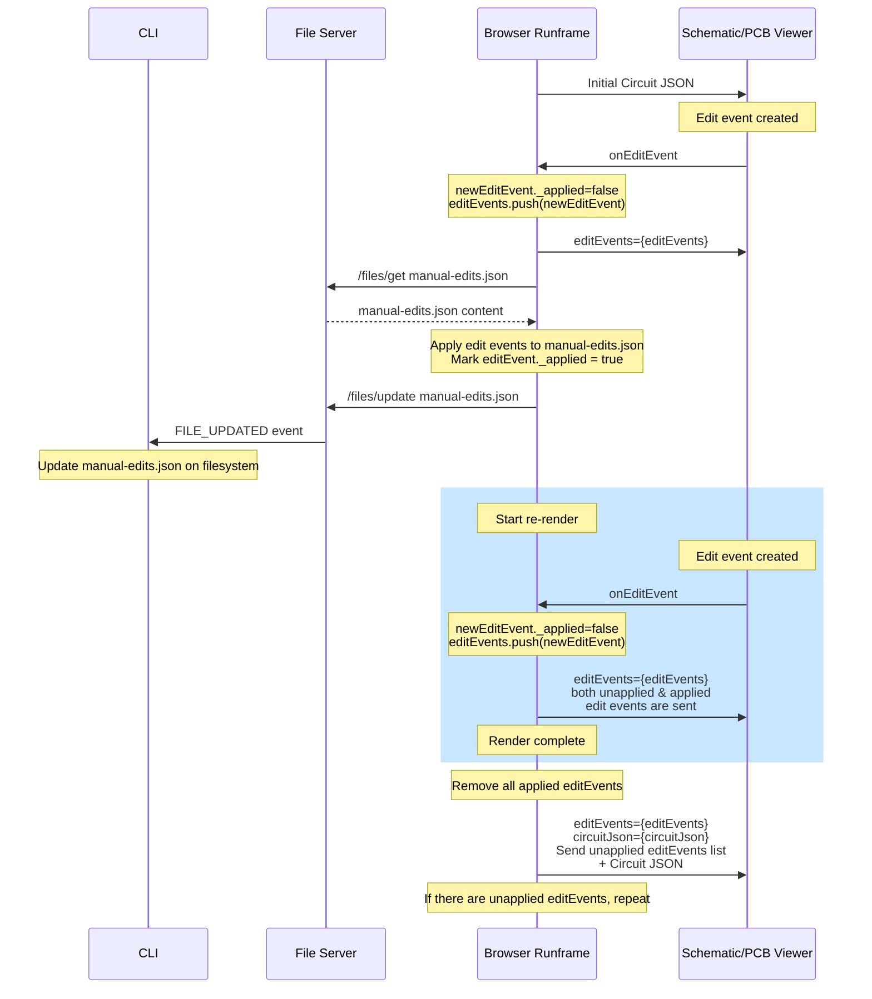

# @tscircuit/runframe

[tscircuit](https://github.com/tscircuit/tscircuit) ⋅ [View Examples](https://runframe.vercel.app)

A React component that runs tscircuit inside a webworker and shows you the PCB,
Schematic, 3D and other previews.

- Automatically imports other snippets and libraries if imported
- Runs inside webworker (doesn't block the main thread)
- Converts typescript to javascript using babel

## Usage

```tsx
import { RunFrame } from "@tscircuit/runframe/runner"

const App = () => (
  <RunFrame
    fsMap={{
      "main.tsx": `
circuit.add(
  <resistor resistance="1k" />
)
`,
    }}
    entrypoint="main.tsx"

    // Listen to events
    onCircuitJsonChange={(circuitJson) => void}
    onRenderingFinished={({ circuitJson }) => void}
    onRenderEvent={(event) => void}
    onError={(error) => void}
  />
)
```

### Using CircuitJsonPreview Directly

If you already have circuit JSON and just want to display it:

```tsx
import { CircuitJsonPreview } from "@tscircuit/runframe/preview"

const App = () => (
  <CircuitJsonPreview
    circuitJson={myCircuitJson}
    // Optional props
    showCodeTab={false}      // Show/hide the code editor tab
    showJsonTab={true}       // Show/hide the raw JSON viewer tab
    className="h-screen"     // Container className
    headerClassName="px-4"   // Header className
    isFullScreen={false}     // Toggle fullscreen mode
    onToggleFullScreen={() => void}  // Fullscreen toggle callback
  />
)
```

The CircuitJsonPreview component provides:

- PCB view with interactive component placement
- Schematic view
- Assembly view
- 3D view
- Bill of Materials (BOM) table
- Circuit JSON viewer
- Error display

> Note: You should have tailwind installed in the parent project, this library
> works without installing tailwind but without the "css reset" things will look
> a bit off (e.g. you might see serif fonts), create an issue if that's
> cumbersome because we removed it to save 5kb

## Development

### File-Server Interaction with Edit Events

Edit events can be a complex to understand, because it can take some
time for rendering to complete, edit events are applied for an
approximate render before the circuit is fully rendered. The sequence
diagram below can be used as a reference to understand how the edit events
are applied and queued for rendering.


